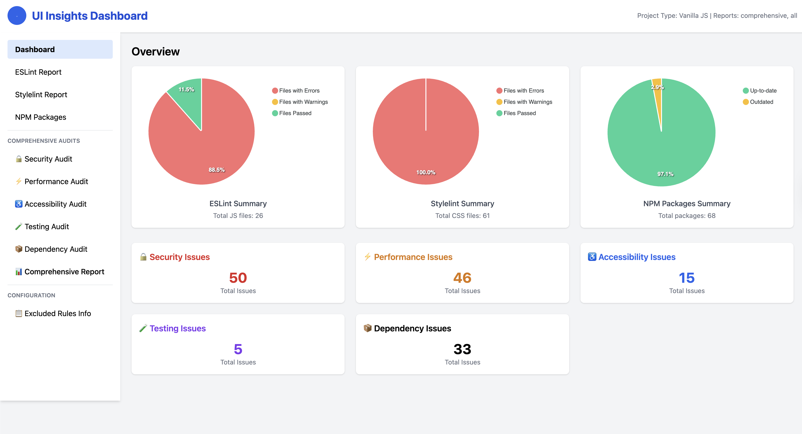

# UI Insights Report Generator (ui-code-insight)

> **Your all-in-one CLI for auditing, visualizing, and improving code quality, security, and maintainability in modern JavaScript, TypeScript, and CSS projects. Instantly generate actionable dashboards and reports—no setup required.**

---

## 🚀 Quick Start

```bash
npx ui-code-insight
```
> _No install, no config, instant insights._

### 📊 Live Demo
Check out the [Audit Sample Dashboard](https://deepak121001.github.io/Audit-Sample/) to see the tool in action with sample projects!


---

## 🌟 Why Use UI Code Insight?

| Feature                | Benefit                                 |
|------------------------|-----------------------------------------|
| **Interactive CLI**        | No config needed, just run and go       |
| **Multi-framework support**| Works with React, Node, TS, Vanilla JS  |
| **Comprehensive audits**   | Security, Performance, Accessibility... |
| **Smart dependency mgmt**  | Installs only what you need             |
| **Visual dashboard**       | See all issues in one place             |
| **Live demo available**    | [Try it now](https://deepak121001.github.io/Audit-Sample/) |

---

## 📦 Usage Examples

### 🎯 Live Demo
Experience the full UI Code Insight dashboard with sample projects: **[Audit Sample Dashboard](https://deepak121001.github.io/Audit-Sample/)**

### CLI Prompt Example
```
? What type of project is this? (Use arrow keys)
❯ React

? Would you like to install all required dependencies for React? (Y/n)
❯ Yes

Installing missing dependencies: eslint-plugin-jsx-a11y eslint-config-airbnb
✅ Dependencies installed successfully!

? Which report(s) do you want to generate? (Press <space> to select, <a> to toggle all, <i> to invert selection)
❯◯ ESLint
 ◯ Stylelint
 ◯ Package Report
 ◯ Security Audit
 ◯ Performance Audit
 ◯ Accessibility Audit
 ◯ Modern Practices Audit
 ◯ Testing Audit
 ◯ Dependency Audit
 ◯ Comprehensive Audit (All Categories)
 ◯ All Traditional Reports
```

### Sample Report Output (JSON)
```json
{
  "category": "security",
  "issues": [
    {
      "file": "src/server.js",
      "line": 42,
      "severity": "high",
      "message": "Hardcoded secret detected",
      "snippet": "const password = 'supersecret';"
    }
  ]
}
```

---

## 🛠️ Supported Project Types

- React
- Node.js
- Vanilla JavaScript
- TypeScript
- TypeScript + React

---

## 🔍 Audit Categories At a Glance

- 🔒 **Security**: Find secrets, XSS, vulnerable deps
- ⚡ **Performance**: Flag large bundles, dead code
- ♿ **Accessibility**: Check alt text, headings, ARIA
- 🧪 **Testing**: Detect missing or weak tests
- 📦 **Dependencies**: Outdated, unused, or risky packages

---

## 🔒 Security Audit Coverage

Our comprehensive security audit covers multiple layers of security vulnerabilities and best practices:

### 🔐 **Hardcoded Secrets Detection**
- **API Keys & Tokens**: Detects exposed API keys, access tokens, refresh tokens
- **Passwords & Credentials**: Finds hardcoded passwords and authentication secrets
- **Private Keys**: Identifies exposed private keys and certificates
- **Connection Strings**: Spots database and service connection strings
- **Pattern Matching**: Uses advanced regex patterns to catch various secret formats

### 🛡️ **Input Validation & XSS Prevention**
- **HTML Input Validation**: Checks for missing validation attributes (`required`, `pattern`, `maxlength`)
- **Unsafe DOM Insertion**: Detects dangerous `innerHTML` and `dangerouslySetInnerHTML` usage
- **Line-by-Line Analysis**: Processes each line individually for precise issue detection
- **Context-Aware Reporting**: Provides exact line numbers and surrounding code context
- **Real-time Progress**: Shows scanning progress for better user experience

### 📁 **File Upload Security**
- **Type Restrictions**: Ensures file inputs have `accept` attributes for type validation
- **Size Limits**: Checks for file size restrictions (`max` attributes)
- **Filename Sanitization**: Detects unsafe direct usage of `file.name` without sanitization
- **Upload Logic Analysis**: Scans JavaScript files for proper file handling practices
- **Precise Detection**: Line-by-line analysis with exact line numbers and code context
- **HTML & JS Coverage**: Scans both HTML file inputs and JavaScript upload logic

### 🔍 **Code Injection & Execution Vulnerabilities**
- **eval() Usage**: Flags dangerous `eval()` function calls
- **Function Constructor**: Detects `new Function()` usage
- **Dynamic Code Execution**: Identifies patterns that could lead to code injection
- **Enhanced Pattern Scanning**: Line-by-line analysis with precise location reporting
- **Context-Aware Detection**: Provides surrounding code for better issue understanding

### 🌐 **Network & Transport Security**
- **Insecure HTTP**: Detects non-HTTPS requests (`http://` URLs)
- **Development URLs**: Flags localhost and development URLs in production code
- **Token Exposure**: Identifies exposed Bearer tokens in code

### 🎯 **Content Security Policy (CSP) - HTML Files Only**
- **HTML-Only Scanning**: Exclusively scans HTML files (`.html`, `.htm`, `.jsp`, `.htl`, `.xhtml`, `.shtml`) for CSP
- **Missing CSP Headers**: Detects absence of Content-Security-Policy meta tags
- **Weak CSP Configurations**: Identifies unsafe CSP settings like `'unsafe-inline'`
- **Security Headers**: Checks for missing HSTS and X-Frame-Options headers
- **Precise Location**: Provides exact line numbers and code context for CSP issues
- **JavaScript Exclusion**: Never scans JS files for CSP (as they don't contain CSP headers)

### 📦 **Dependency Vulnerability Scanning**
- **npm audit Integration**: Runs `npm audit` to check for known vulnerabilities
- **Package Analysis**: Identifies outdated or vulnerable dependencies
- **Security Recommendations**: Provides specific update recommendations

### 🔧 **ESLint Security Plugin Integration**
- **Security Rules**: Leverages ESLint security plugins for additional checks
- **Custom Security Patterns**: Implements project-specific security rule detection
- **Rule-Based Analysis**: Uses established security linting rules

### 📊 **Comprehensive Reporting**
- **Severity Levels**: Categorizes issues as High, Medium, or Low priority
- **Line-by-Line Analysis**: Provides exact file locations and line numbers
- **Code Context**: Shows surrounding code for better issue understanding
- **Deduplication**: Removes duplicate findings for cleaner reports
- **JSON Export**: Generates structured reports for integration with other tools

### 🎛️ **Configurable Exclusions**
- **Custom Rules**: Allow project-specific security rule exclusions
- **Pattern Filtering**: Exclude specific code patterns from security checks
- **Flexible Configuration**: Adapt security scanning to project requirements

### 🔄 **Continuous Security Monitoring**
- **Automated Scanning**: Integrate security checks into CI/CD pipelines
- **Regular Audits**: Schedule periodic security assessments
- **Trend Analysis**: Track security improvements over time

### 🚀 **Technical Enhancements**
- **Async File Processing**: Improved performance with non-blocking file operations
- **Memory Optimization**: Efficient line-by-line processing with garbage collection
- **Error Resilience**: Graceful handling of file read errors and malformed content
- **Progress Tracking**: Real-time progress indicators for better user experience
- **Smart File Filtering**: Intelligent exclusion of build artifacts and dependencies

---

## 🛡️ How It Works

1. **Select audits via CLI**: Choose which audits to run.
2. **File scanning**: Scans your codebase, excluding common build/output folders.
3. **Pattern matching & analysis**: Uses static analysis and best-practice checks.
4. **Report generation**: Saves results as JSON in the `report/` directory.
5. **Dashboard visualization**: View all results in a single dashboard.

---

## ⚙️ Configuration

**Do I need a config file?**
- **No!** Defaults work for most users. Just run and go.
- For custom file patterns or advanced settings, create `ui-code-insight.config.json` in your project root.

### `ui-code-insight.config.json` Reference

You can customize how files are scanned and which rules are excluded by adding a `ui-code-insight.config.json` file to your project root. Example:

```json
{
  "jsFilePathPattern": [
    "./src/**/*.js",
    "./src/**/*.ts",
    "./src/**/*.jsx",
    "./src/**/*.tsx",
    "!./dist/**",
    "!./build/**"
  ],
  "htmlFilePathPattern": [
    "**/*.{html,js,ts,jsx,tsx}",
    "!**/node_modules/**"
  ],
  "scssFilePathPattern": [
    "**/*.{scss,css,less}",
    "!**/node_modules/**"
  ],
  "excludeRules": {
    "eslint": {
      "enabled": true,
      "overrideDefault": false,
      "additionalRules": ["my-custom-rule"]
    },
    "stylelint": {
      "enabled": true,
      "overrideDefault": false,
      "additionalRules": ["my-custom-style-rule"]
    },
    "dependency": {
      "enabled": true,
      "overrideDefault": false,
      "additionalRules": ["custom-dependency-rule"]
    }
    // ... other audit types ...
  }
}
```

- **jsFilePathPattern, htmlFilePathPattern, scssFilePathPattern**: Glob patterns for files to include/exclude in audits.
- **excludeRules**: Fine-tune which rules are enabled/disabled for each audit type. You can add custom rules or override defaults.

---

## ⚠️ Important Usage Note

**Do not run 'Comprehensive Audit (All Categories)' and 'All Traditional Reports' together on large projects.**

Running both at the same time may cause the tool to crash or run out of memory on large codebases. For best results, run one or the other, not both together.

---

## ❓ FAQ

**Q: How accurate are the reports?**  
A: 
- **Rule-Based Static Analysis:** The tool uses established static analysis engines (like ESLint, Stylelint, and custom audits) that apply well-known rules and patterns to your codebase. The accuracy of each report is tied to the quality and completeness of these rules.
- **Coverage of Patterns:** The tool looks for a wide range of issues, but it can only find what it’s programmed to detect. If an issue falls outside these patterns, it won’t be flagged.
- **No False Positives/Negatives Guarantee:** Like all static analysis tools, there may be false positives (flagging something that isn’t really a problem) or false negatives (missing a real issue). The tool aims to minimize these by using up-to-date, community-accepted rules and by allowing configuration for project-specific needs.
- **Transparency and Customization:** The tool outputs detailed reports, so users can review and verify each finding. Users can customize rules or add exceptions to improve relevance and reduce noise.
- **Not a Substitute for Manual Review:** Automated tools are a first line of defense and help catch common issues quickly. For critical applications, manual code review and testing are still recommended to catch context-specific or business-logic issues.

**Q: Do I need to configure anything?**  
A: No! Defaults work for most users. Advanced users can add a config file.

**Q: Where are reports saved?**  
A: In the `report/` directory at your project root.


---

## Dependencies
- [Stylelint](https://www.npmjs.com/package/stylelint)
- [ESLint](https://www.npmjs.com/package/eslint)
- [@typescript-eslint/eslint-plugin](https://www.npmjs.com/package/@typescript-eslint/eslint-plugin)
- [eslint-config-airbnb](https://www.npmjs.com/package/eslint-config-airbnb)
- [eslint-config-airbnb-base](https://www.npmjs.com/package/eslint-config-airbnb-base)
- [eslint-config-airbnb-typescript](https://www.npmjs.com/package/eslint-config-airbnb-typescript)

---

## Repository

GitHub: [https://github.com/deepak121001/ui-code-insight.git](https://github.com/deepak121001/ui-code-insight.git)

## 📊 Live Demo & Samples

- **Audit Sample Dashboard**: [https://deepak121001.github.io/Audit-Sample/](https://deepak121001.github.io/Audit-Sample/)
- **Sample Projects**: Explore React, Node.js, and Vanilla JavaScript projects with intentional issues for testing
- **Interactive Reports**: View ESLint, Stylelint, Security, Accessibility, and Performance audits in action

---

## 🤝 Contributing

Contributions, issues, and feature requests are welcome!
Feel free to check [issues](https://github.com/deepak121001/ui-code-insight/issues) or open a pull request.

1. Fork the repo
2. Create your feature branch (`git checkout -b feature/YourFeature`)
3. Commit your changes (`git commit -am 'Add new feature'`)
4. Push to the branch (`git push origin feature/YourFeature`)
5. Open a pull request

---

## 🗺️ Roadmap

- [ ] AI-powered code suggestions
- [ ] More framework support
- [ ] Customizable dashboard themes

---

## 📝 License

_This project is licensed under the MIT License._

